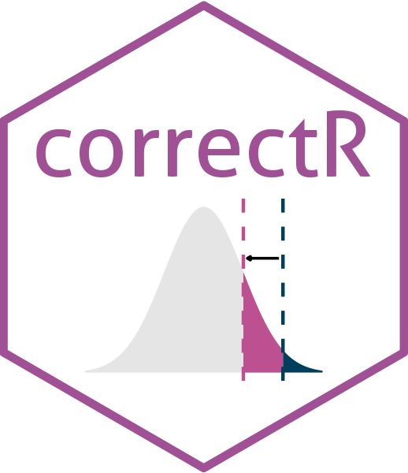

# correctR 

[](https://www.r-pkg.org/pkg/correctR)
[](https://www.r-pkg.org/pkg/correctR)
[](https://zenodo.org/badge/latestdoi/578642033)

Corrected test statistics for comparing machine learning models on
correlated samples

## Installation

You can install the stable version of `correctR` from CRAN:

``` r
install.packages("correctR")
```

You can install the development version of `correctR` from GitHub:

``` r
devtools::install_github("hendersontrent/theft")
```

## General purpose

Often in machine learning, we want to compare the performance of
different models to determine if one statistically outperforms another.
However, the methods used (e.g., data resampling, $k$-fold
cross-validation) to obtain these performance metrics (e.g.,
classification accuracy) violate the assumptions of traditional
statistical tests such as a $t$-test. The purpose of these methods is to
either aid generalisability of findings (i.e., through quantification of
error as they produce multiple values for each model instead of just
one) or to optimise model hyperparameters. This makes them invaluable,
but unusable with traditional tests, as [Dietterich
(1998)](https://pubmed.ncbi.nlm.nih.gov/9744903/) found that the
standard $t$-test underestimates the variance, therefore driving a high
Type I error. `correctR` is a lightweight package that implements a
small number of corrected test statistics for cases when samples are not
independent (and therefore are correlated), such as in the case of
resampling, $k$-fold cross-validation, and repeated $k$-fold
cross-validation. These corrections were all originally proposed by
[Nadeau and Bengio
(2003)](https://link.springer.com/article/10.1023/A:1024068626366).
Currently, only cases where two models are to be compared are supported.

## Python version

A Python version of `correctR` called `correctipy` is available at the
[GitHub repository](https://github.com/hendersontrent/correctipy).
